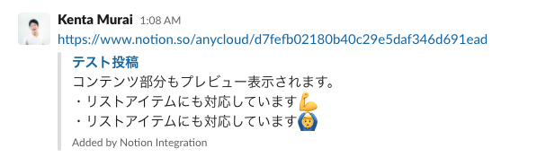

# slack-notion-preview

[][license]

Notion リンクを Slack 上で展開してくれる君

## Description

private な Notion リンクが Slack に投稿された際に、それを展開してくれる Slack App です。

## Features

- Notion の記事タイトル展開（プロパティは未対応）
- Notion の記事コンテンツ展開（通常テキスト、箇条書きリスト、番号リストのみ対応）

## Installation

1. Notion API の Integrations を Internal integrations で作成し、token を取得
2. Slack App 作成
3. notion-deglacer のデプロイ
4. 2 で作った app に、3 の URL を登録する
5. Slack App の bot ユーザーをチャンネルに招待する
6. 展開したいページで Integration を許可する

### 1. Notion API の Integrations を Internal integrations で作成し、token を取得

[Getting Started](https://developers.notion.com/docs/getting-started) を参考にしながらアクセストークンを取得してください。

### 2. Slack App の作成

1. https://api.slack.com/apps の Create New App からアプリ作成
2. 左メニュー OAuth & Permissions を開き、Scopes で link:write を追加
3. 左メニュー Event Subscriptions を開く
   - App unfurl domains を展開し、 Add Domain で、 `www.notion.so` を入力し、Save Changes
4. 左メニュー Install App を開き、 Install App to Workspace -> Allow
5. OAuth Access Token が表示されるのでメモ (`SLACK_TOKEN`)
6. Basic Information を開き App Credentials の Signing Secret をメモ (`SLACK_SIGNING_SECRET`)

※後で戻ってくるので、Slack App の管理画面は開いたままにしておく。

### 3. slack-notion-preview のデプロイ

Node.js で書かれた Web アプリケーションなので、任意の場所で簡単に動かせますが、Heroku や Google App Engine を利用するのがより簡単でしょう。動作のためには以下の環境変数が必要です。

- `NOTION_TOKEN`: 手順 1 で取得した Notion のアクセストークン
- `SLACK_TOKEN`: 手順 2-5 で取得した Slack App のトークン
- `SLACK_SIGNING_SECRET`: 手順 2-6 で取得したリクエスト署名検証 secret

#### Heroku で動かす場合

以下のボタンからデプロイできます。

### 4. 2 で作った app に、3 の URL を登録する

- 左メニュー Event Subscriptions を開き、 Request URL に 3 でデプロイした deglacer の URL を入力
- Verified と表示されたら Enable Events を On にして Save Changes

### 5. Slack App の bot をチャンネルに招待する

Bot 名は、左メニューの App Home から確認してください。

### 6. 展開したいページで Integration を許可する

API 経由でのアクセスをするためには、そのページで Integration を許可する必要があります。  

現状ワークスペースレベルで全てのページを許可することはできないようです。  
とはいえ親ページで許可をすれば子孫のページでも適用されるため、サイドバーの各ページで許可をすれば面倒ですが解決は可能です。

これで準備完了です。

## See Also

notion-deglacer は[MH4GF さんのリポジトリ](https://github.com/MH4GF/notion-deglacer)を参考に作られています。  
特に README の大半をそのまま利用させていただいています。この場をお借りして御礼申し上げます。
