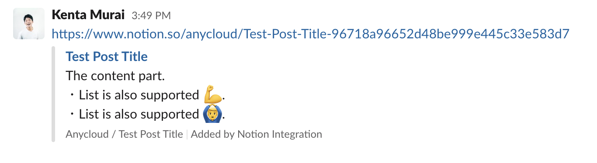
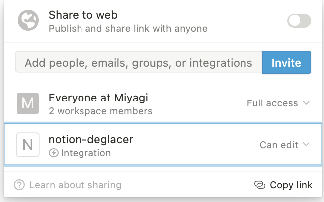

# slack-notion-preview

⚠️⚠️⚠️

**The official Slack x Notion app has been released and we recommend using the official app instead of this repository.**
https://slack.com/apps/A049JV0H0KC-notion

⚠️⚠️⚠️

English | [日本語](/README.ja.md)

## Description

A Slack App that shows a preview of a private Notion link posted to Slack.

## Features

- Notion article title preview (properties not yet supported)
- Notion article content preview
  - Heading
  - Paragraph
  - Bulleted list
  - Numbered list
  - TODO List

## Installation

1. Create Notion API Integrations with Internal integrations and obtain a token
2. Create Slack App
3. Deploy slack-notion-preview
4. Register the URL of step 3 to the app created in step 2
5. Invite Slack App bot users to the channel
6. Allow Integration on the pages you want to unfurl

### STEP 1: Create Integrations for Notion API with Internal integrations and get a token.

Refer to [Getting Started](https://developers.notion.com/docs/getting-started) to obtain an access token.

### STEP 2: Creating Slack App

1. Create an app from `Create New App` at https://api.slack.com/apps
2. Open `OAuth & Permissions` in the left menu and add `link:write` in Scopes.
3. Open `Event Subscriptions` from the left menu.
   - Expand `App unfurl domains`, under `Add Domain`, enter `www.notion.so`, and save changes.
4. Open `Install App` from the left menu, set `Install App to Workspace` to `Allow`
5. Note the `OAuth Access Token` when it appears (`SLACK_TOKEN`)
6. Open `Basic Information` and note `Signing Secret` in `App Credentials` (`SLACK_SIGNING_SECRET`)

※ Leave the Slack App admin screen open, as you will return to it later.

### STEP 3: Deploy slack-notion-preview

Since it is a web application written in Node.js, it can easily be run anywhere, but using Heroku or Google App Engine is probably easier. The following environment variables are required for operation.

- `NOTION_TOKEN`: Notion's access token obtained in step 1
- `SLACK_TOKEN`: Slack App token obtained in steps 2-5
- `SLACK_SIGNING_SECRET`: Request signature verification secret obtained in step 2-6

#### Running on Heroku

You can deploy from the following button

※ The page will not be displayed even if you access the URL root of the deployed app, but this is just a specification, so don't worry about it.

### STEP 4: Register the URL of STEP 3 to the app created in STEP 2.

- Open the left menu `Event Subscriptions`
- Enter `{URL of the app deployed in STEP 3}/slack/events` in Request URL (e.g. https://your-app.herokuapp.com/slack/events)
- When `Verified` is displayed, turn `Enable Events` on and save changes.

### STEP 5: Invite Slack App bot to the channel.

Check the Bot name from App Home on the left menu.

### STEP 6: Allow Integration on the page you want to deploy.

In order to access via API, Integration must be allowed on that page.  

Currently, it does not seem possible to allow all pages at the workspace level.  
However, if you allow it on the parent page, it will be applied to the descendant pages, so it is possible to solve this problem, although it is troublesome to allow it on each page in the sidebar.

Now you are ready to go.
